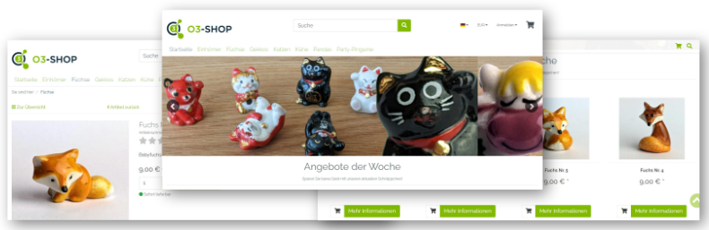

```{toctree}
:maxdepth: 1
:hidden:
Welcome <welcome>
```
```{toctree}
:maxdepth: 1
:hidden:
:caption: User Manual
Installation <user/installation/index>
Konfiguration <user/configuration>
Verwendung <user/usage>
```
```{toctree}
:maxdepth: 1
:hidden:
:caption: Developer Manual
Extension <developer/Extension>
Get involved <developer/GetInvolved>
```

# O3-Shop TinyMCE editor plugin



Das ist ein Modul, welches den Adminbereich des O3-Shops um einen WYSIWYG Editor erweitert.

## About

- Join the [Community](https://community.o3-shop.com)
- Website: [https://www.o3-shop.com](https://www.o3-shop.com)
- Issue tracker: [https://issues.o3-shop.com](https://issues.o3-shop.com)
- License: [GNU General Public License 3](https://www.gnu.org/licenses/gpl-3.0.de.html)

Thank you for using O3-Shop!