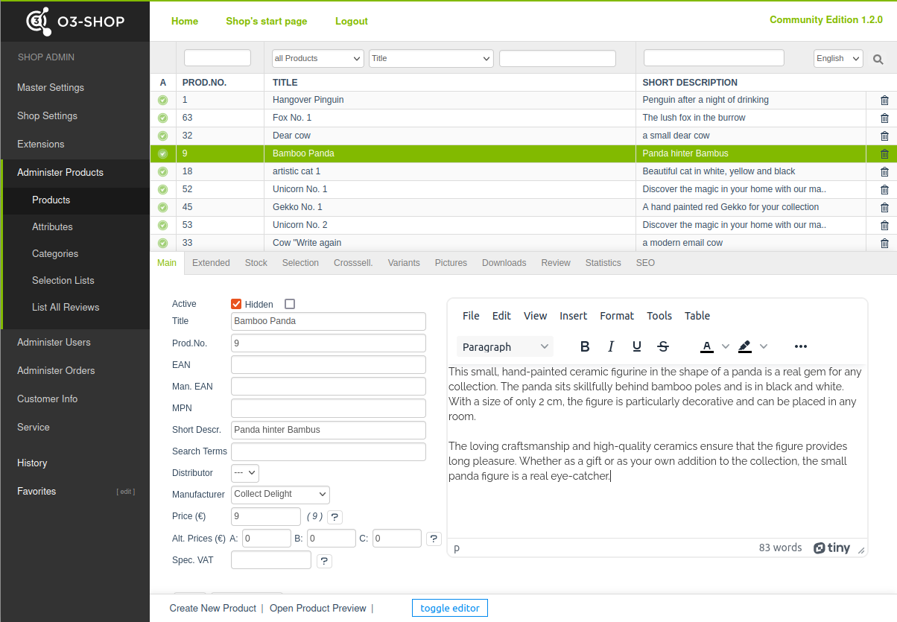

```{toctree}
:maxdepth: 1
:hidden:
Welcome <Welcome>
```
```{toctree}
:maxdepth: 1
:hidden:
:caption: User Manual
Installation <User/Installation/index>
Configuration <User/Configuration>
Use <User/Use>
```
```{toctree}
:maxdepth: 1
:hidden:
:caption: Developer Manual
Customization <Developer/Customization>
Get involved <Developer/GetInvolved>
```

# O3-Shop TinyMCE editor plugin




TinyMCE is a module which provides a HTML editor for the Shop Admin.

## About

- Join the [Community](https://community.o3-shop.com)
- Website: [https://www.o3-shop.com](https://www.o3-shop.com)
- Issue tracker: [https://issues.o3-shop.com](https://issues.o3-shop.com)
- License: [GNU General Public License 3](https://www.gnu.org/licenses/gpl-3.0.de.html)

Thank you for using O3-Shop!
